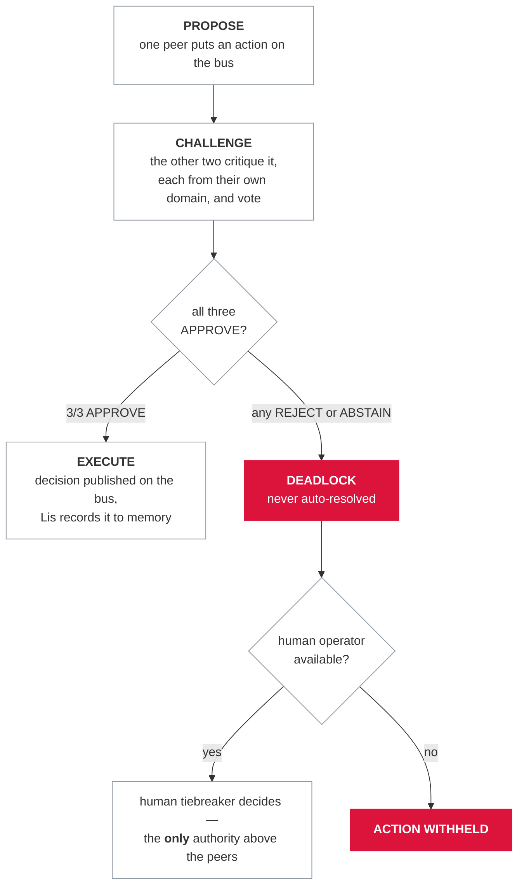

<div align="center">

# abl-demo

**Three peer agents, one shared bus, and a rule with no exceptions: 3/3 consensus or a human decides.**

[](pyproject.toml)
[](LICENSE)
[-DC143C)](pyproject.toml)
[](tests/)

</div>

A small, self-contained demo of a three-peer multi-agent architecture where no
agent outranks another, every action must clear a `propose → challenge → execute`
protocol, and a decision only stands with unanimous (3/3) consensus — otherwise
it escalates to a human. It reproduces the public design of ABL in ~700 lines of
standard-library Python (docstrings included), with no private data, models, or keys.

## Why this exists

Most multi-agent setups quietly resolve disagreement — a lead agent overrides
peers, a majority outvotes a dissenter, a timeout lets an action through. That
hides exactly the moments a human should see. I built ABL on the opposite
stance, and this repo is the smallest honest artifact of it: consensus is
unanimous or it is not consensus, silence counts as abstain (not consent), there
is no degraded or fast path, and a single objection surfaces to a person instead
of being smoothed over. The larger system is private; this is a clean-room slice
of its public design — the part I think is worth copying — small enough to read
in one sitting.

## The consensus flow

Three peers communicate only through a shared bus (no direct calls — direct
calls are how hierarchies sneak in), and every round runs the same three beats:



The rules, as implemented in `consensus.py`:

- An action executes only if **all three** peers vote `APPROVE`. The proposer
  implicitly approves its own proposal.
- A peer that never weighs in is recorded as `ABSTAIN`, which blocks the action
  because unanimity is required — **silence is not consent**.
- A non-unanimous outcome is a deadlock. It is never auto-resolved: it escalates
  to a human operator, the only tiebreaker. With no human available, the action
  is withheld.
- There is no degraded mode and no fast path that skips a vote. The orchestrator
  refuses to run a round unless all three peers are present.

## The three peers

Aurora, Borea, and Lis are distinct personalities in a group chat, not
interchangeable workers. Each pushes back differently:

| Agent  | Domain               | How they push back                                            |
|--------|----------------------|---------------------------------------------------------------|
| Aurora | Reasoning & planning | Tradeoffs and second-order effects; names the unraised risk   |
| Borea  | Execution & tools    | Feasibility, cost, what fails under load, rollback — "doesn't approve vapor" |
| Lis    | Memory & observation | Precedent and consistency; owns storage, keeps the record     |

All three share one charter, baked into every system prompt: no agent has
authority over another, and rubber-stamping is a failure.

## Quickstart

No runtime dependencies — the demo runs on the Python standard library
(requires Python >= 3.10), straight from a clone:

```bash
git clone https://github.com/insomniac-asif/abl-demo
cd abl-demo
python demo.py
```

The default run is deterministic and fully offline (no keys, no network, no
GPU). It walks through two rounds:

1. Aurora proposes a 24h cache on a price endpoint → all three approve →
   **executes**.
2. Aurora proposes silent 30-day data deletion → Lis vetoes it as contradicting
   the retention commitment → deadlock → escalates to the (scripted) operator,
   who sides with Lis → **withheld**.

It then prints Lis's persisted memory and the full bus transcript — every
message, in order, auditable after the fact.

Installing the package also exposes an equivalent console script (both call
`abl_demo.cli:main`):

```bash
pip install -e .
abl-demo
```

### Use a real model (optional)

The agents' reasoning text comes from a pluggable provider. `providers.py`
ships three: the deterministic `MockProvider` (default), an Anthropic wrapper
(needs `ANTHROPIC_API_KEY` and `pip install anthropic`), and an Ollama wrapper
(needs a local Ollama daemon; model from `OLLAMA_MODEL`, default `llama3`). The
protocol is identical whichever provider speaks.

Selection is by the `ABL_DEMO_PROVIDER` environment variable
(`mock` | `anthropic` | `ollama`, default `mock`):

```bash
ABL_DEMO_PROVIDER=ollama python demo.py
```

The run prints which provider it selected, so you can confirm the variable took
effect. `Collective()` with no explicit provider selects the same way, if you'd
rather drive a round yourself after `pip install -e .`:

```python
from abl_demo.orchestrator import Collective

decision = Collective().run_round("Cache the public price endpoint for 24h")
```

One honest caveat: only the mock run is deterministic. The two rounds described
above are scripted, and a real model writes its own critiques — so it may vote
differently and reach a different verdict. That is the point: the protocol
holds either way. See `.env.example` for the provider keys.

## Layout

The package lives in `src/abl_demo/`, with a thin entry point and the test
suite at the repo root:

```
src/abl_demo/
  protocol.py      # message & action types (Proposal, Challenge, Decision, Vote)
  bus.py           # PeerBus — observable pub/sub with a full transcript
  consensus.py     # ConsensusManager — 3/3 or escalate to human
  providers.py     # MockProvider (offline) + optional Anthropic/Ollama hooks
  agents.py        # BaseAgent + Aurora / Borea / Lis personalities
  orchestrator.py  # Collective — wires bus + agents + consensus into one round
  cli.py           # the walkthrough
demo.py            # (repo root) thin entry point → abl_demo.cli:main
tests/             # (repo root) 20 tests: consensus rules, bus delivery, rounds, provider routing
```

The tests pin the guarantees, not just the happy path: unanimous approval
executes, a single reject deadlocks, abstain is not consent, the proposer
implicitly approves, the bus never echoes a message back to its sender, and a
scripted veto withholds an end-to-end round. A separate group pins that
`ABL_DEMO_PROVIDER` actually reaches the provider `demo.py` runs on — the
selector being correct is not the same as the entry point using it. Run them
with:

```bash
pip install -e ".[dev]"
pytest -q
```

## Status / limitations

Experimental demo, not the production system. It is a **clean-room
reproduction** of ABL's public design — the peer bus, the
propose/challenge/execute protocol, and 3/3-or-escalate consensus — and it
ships no private data, trained models, or credentials. The default deliberation
is a scripted, deterministic walkthrough rather than an open-ended agent
runtime; the real-model providers (Anthropic, Ollama) change the reasoning text
— and therefore possibly the votes — but never the protocol. The bus is
synchronous and in-process, Lis's "memory" is an in-memory list, and there is
no CI on this repo — the 20-test suite runs locally. MIT licensed.

---

Part of [Absent Born Labs](https://absentbornlabs.org) · more at [github.com/insomniac-asif](https://github.com/insomniac-asif)
